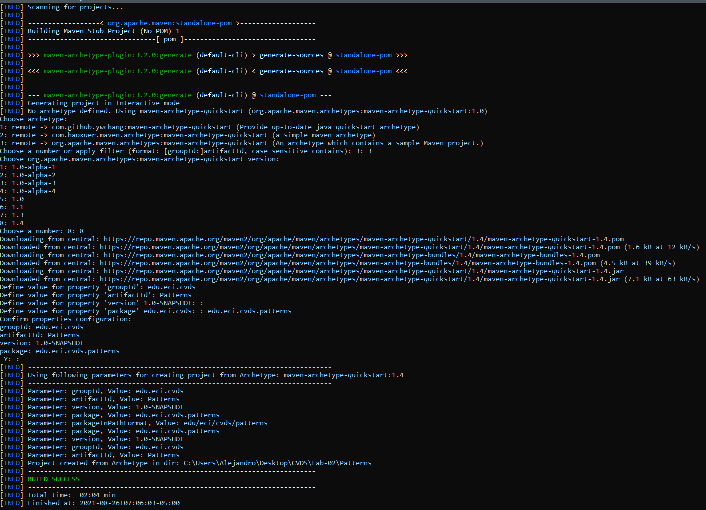
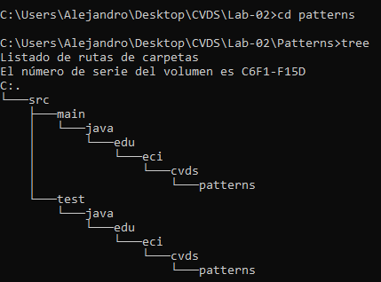
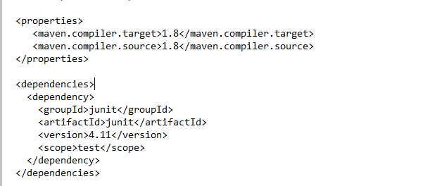
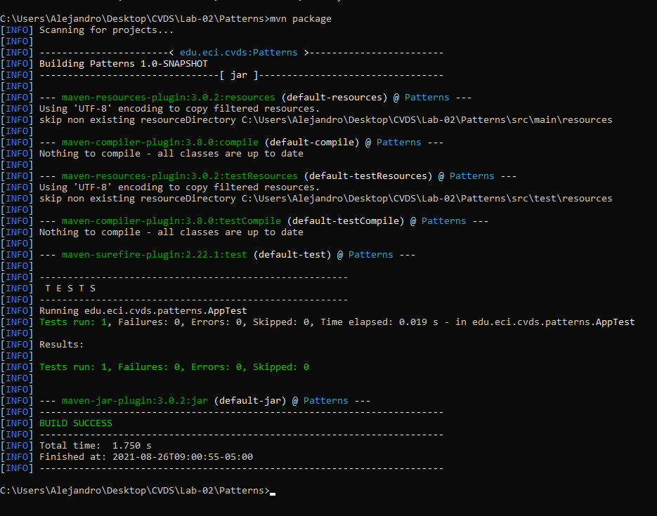
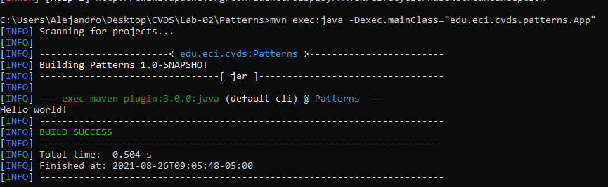
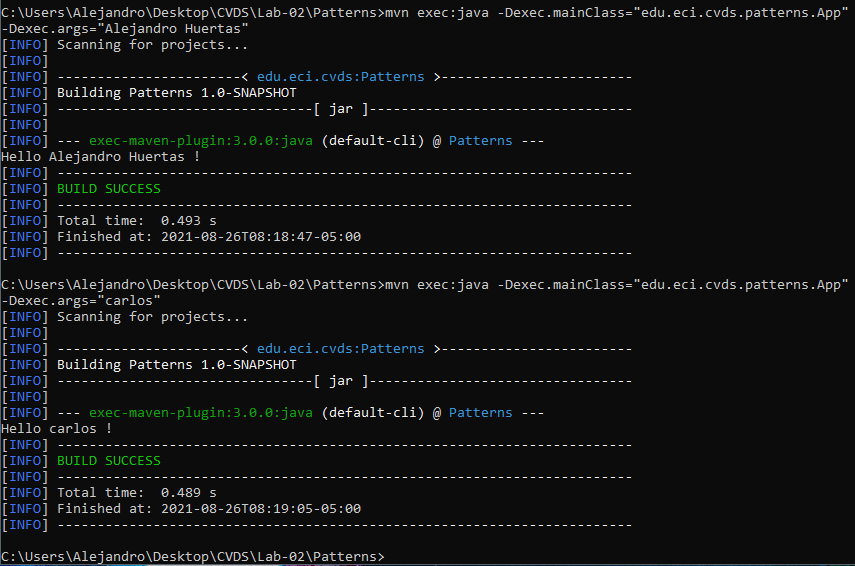
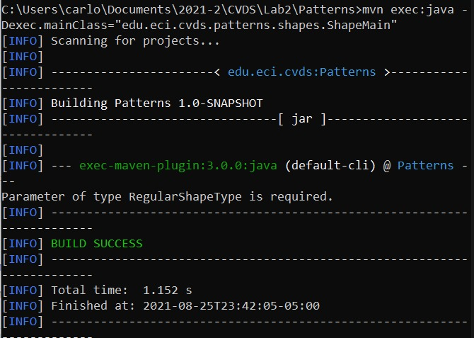
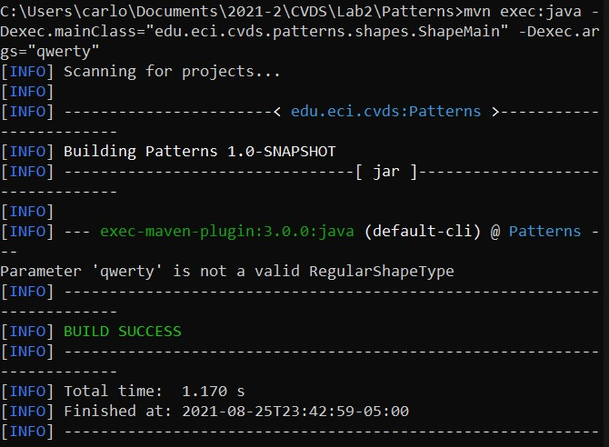
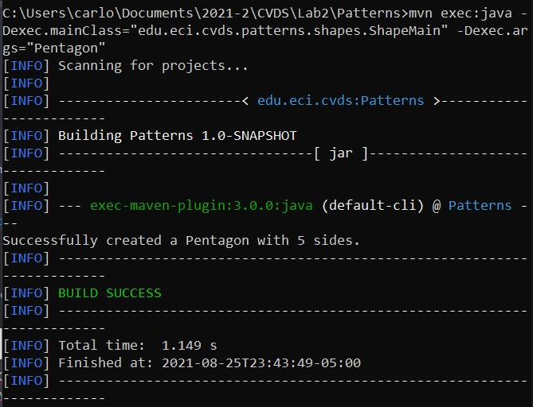
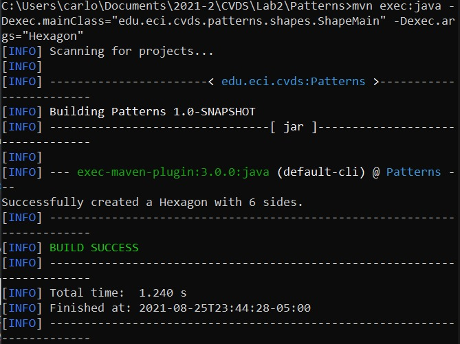

# LABORATORIO 2 - PATTERNS - 2021-2

PATTERNS - FACTORY
LA HERRAMIENTA MAVEN

## EJERCICIO DE LAS FIGURAS

CREAR UN PROYECTO CON MAVEN

* Buscar cómo se crea un proyecto maven con ayuda de los arquetipos (archetypes).
  
  Para crear un proyecto en maven con arquetipos en primer lugar usamos 
  
    - **mvn archetype:generate -Dfilter=maven-archetype-quickstart**
    
  Este genera el proyecto, a continuacion solicitará algunos parametros, definidos en el enunciado.
  
    - Grupo: edu.eci.cvds
    - Id del Artefacto: Patterns
    - Paquete: edu.eci.cvds.patterns
    - archetypeArtifactId: maven-archetype-quickstart
   
   
   
* Para ver el conjunto de archivos y directorios creados por el comando mvn ejecute el comando tree.

   
   
## AJUSTAR ALGUNAS CONFIGURACIONES EN EL PROYECTO
* Edite el archivo pom.xml y realize la siguiente actualización:
  - Hay que cambiar la version del compilador de Java a la versión 8, para ello, agregue la sección properties antes de la sección de dependencias:
    
    
    
## COMPILAR Y EJECUTAR
*Para compilar ejecute el comando:

  - $ mvn package

* Busque cuál es el objetivo del parámetro "package" y qué otros parámetros se podrían enviar al comando mvn.
* Busque cómo ejecutar desde línea de comandos, un proyecto maven y verifique la salida cuando se ejecuta con la clase App.java como parámetro en "mainClass". Tip: https://www.mojohaus.org/exec-maven-plugin/usage.html   
    
  - Usamos la linea 
    **mvn exec:java -Dexec.mainClass="edu.eci.cvds.patterns.App"** 
    
   
   
* Realice el cambio en la clase App.java para crear un saludo personalizado, basado en los parámetros de entrada a la aplicación. Utilizar la primera posición del parámetro que llega al método "main" para realizar el saludo personalizado, en caso que no sea posible, se debe mantener el saludo como se encuentra actualmente:
   
   
   
## HACER EL ESQUELETO DE LA APLICACION

* Ejecute múltiples veces la clase ShapeMain, usando el plugin exec de maven con los siguientes parámetros y verifique la salida en consola para cada una:

  - Sin parámetros
  
  
  
  - Parámetro: qwerty
  
  
  
  - Parámetro: pentagon
  
  
  
  - Parámetro Hexagon
  
  
  
  
## Gitignore

* Gitignore es un archivo de texto el cual es implementado para que Git ignore ciertas carpetas o archivos dentro de un proyecto. Normalmente tiene dos modos de uso,  global para ignorar cualquier entrada para un archivo dentro de un repositorio en Git o bien un archivo local el cual es colocado en el directorio raíz del proyecto en git, este se realiza creando el archivo .gitignore, al ser editable como texto se puede modificar a necesidad, las líneas dentro de este archivo deben contener el archivo o carpeta que se dese ignorar, junto con las convenciones “*” la cual es usada como una coincidencia comodín, “/” la cual es usada para ignorar rutas de un archivo.
   

    
